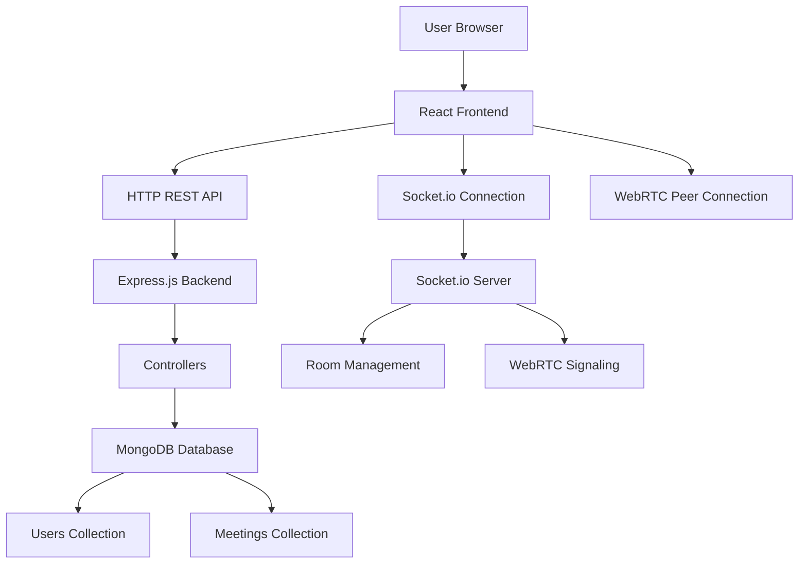
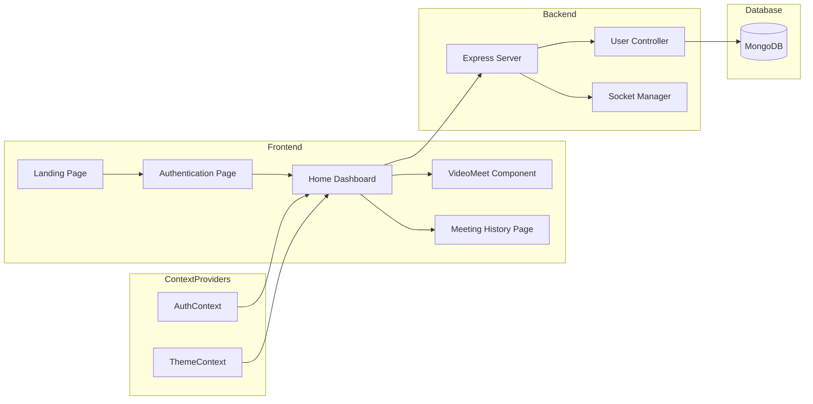
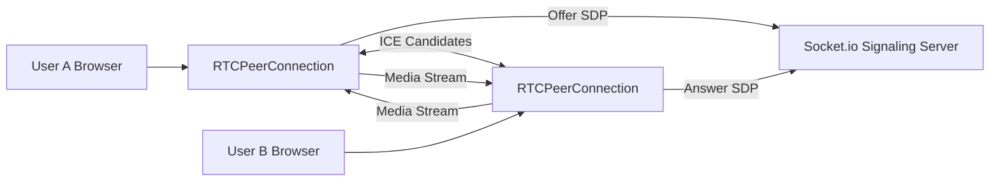
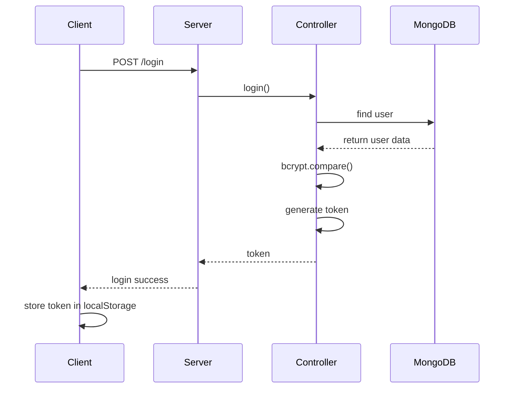
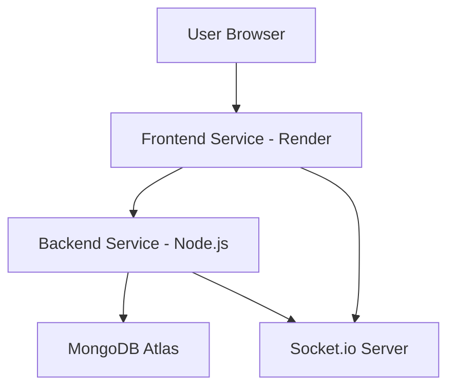

# NeoMeet - System Architecture

## Overview

NeoMeet is a **real-time video conferencing platform** built using the **MERN stack** with **WebRTC** for peer-to-peer video communication and **Socket.io** for real-time signaling and messaging.

The system follows a **three-layer architecture**:

- Client Layer (React Frontend)
- Server Layer (Node.js + Express + Socket.io)
- Data Layer (MongoDB)

This architecture enables **low-latency communication**, **real-time interactions**, and **scalable deployment**.

---

# System Architecture



---

# Application Flow

```mermaid
sequenceDiagram

participant U as User
participant FE as React Frontend
participant BE as Express Backend
participant DB as MongoDB
participant S as Socket.io Server
participant P as Peer Client

U->>FE: Open NeoMeet
FE->>BE: Login/Register Request
BE->>DB: Validate User Credentials
DB-->>BE: Return User Data
BE-->>FE: Authentication Token

U->>FE: Join Meeting
FE->>S: join-call event
S-->>P: Notify user joined

FE->>P: WebRTC Offer
P->>FE: WebRTC Answer

FE<->>P: Direct P2P Video Stream
```

---

# Component Architecture



---

# WebRTC Communication Architecture



---

# Authentication Flow



---

# Deployment Architecture



---

# Technology Stack

## Frontend

| Technology | Purpose |
|-----------|---------|
| React | UI framework |
| React Router | Client-side routing |
| Material UI | Component library |
| Socket.io Client | Real-time communication |
| Axios | API requests |
| WebRTC | Peer-to-peer video/audio |

---

## Backend

| Technology | Purpose |
|-----------|---------|
| Node.js | Runtime environment |
| Express.js | Backend framework |
| Socket.io | WebSocket communication |
| Mongoose | MongoDB ODM |
| bcrypt | Password hashing |
| crypto | Token generation |
| dotenv | Environment variables |

---

## Database

| Technology | Purpose |
|-----------|---------|
| MongoDB | NoSQL database |
| MongoDB Atlas | Cloud database hosting |

---

# API Architecture

## REST Endpoints

| Method | Endpoint | Description |
|------|---------|-------------|
| POST | `/api/v1/users/register` | Register user |
| POST | `/api/v1/users/login` | Login user |
| POST | `/api/v1/users/add_to_activity` | Save meeting history |
| GET | `/api/v1/users/get_all_activity` | Retrieve meeting history |

---

## Socket.io Events

| Event | Direction | Description |
|------|-----------|-------------|
| join-call | Client → Server | Join meeting room |
| user-joined | Server → Client | Notify new participant |
| user-left | Server → Client | Notify user exit |
| signal | Bidirectional | WebRTC signaling |
| chat-message | Bidirectional | Real-time chat |

---

# Data Flow Summary

1. User registers or logs in through REST API
2. Backend validates credentials using MongoDB
3. User joins a meeting room via Socket.io
4. WebRTC signaling occurs through Socket.io server
5. Peer-to-peer connection is established
6. Video and audio streams are transmitted directly between peers
7. Meeting activity is stored in MongoDB

---

# Scalability Considerations

- Stateless backend allows horizontal scaling
- Redis adapter can be added for Socket.io clustering
- MongoDB indexes improve query performance
- WebRTC P2P optimized for small group meetings
- Load balancing can distribute backend traffic

---

# Environment Variables

## Backend

```
PORT=8000
MONGODB_URI=mongodb+srv://your-mongodb-uri
FRONTEND_URL=https://your-frontend-url
```

## Frontend

```
REACT_APP_API_URL=https://your-backend-url
REACT_APP_SOCKET_URL=https://your-backend-url
```

---

# Conclusion

NeoMeet combines **MERN stack architecture**, **WebRTC peer-to-peer streaming**, and **Socket.io real-time communication** to deliver a scalable and responsive video conferencing solution.

The modular architecture ensures **maintainability, scalability, and efficient real-time communication**.
