# NeoMeet – Application Workflow

## Overview

This document describes the **complete user workflows and system processes** in the NeoMeet video conferencing application.

It explains how users move through the system from **landing on the platform → authentication → joining meetings → video communication → history tracking**.

---

# User Journey

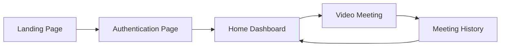

The user journey follows this order:

1. User visits **Landing Page**
2. User **logs in or registers**
3. User reaches the **Home dashboard**
4. User **joins or creates a meeting**
5. After leaving the meeting the **history is saved**

---

# Landing Page Workflow

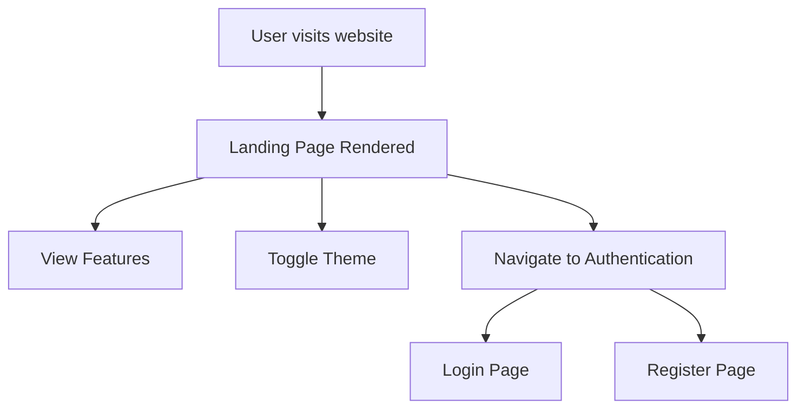

### User Actions

| Action | Trigger | Result |
|------|------|------|
| View landing page | `/` | Homepage loads |
| Toggle theme | Click theme icon | Dark/Light mode switch |
| Click Get Started | Button click | Navigate to `/auth?mode=signup` |
| Click Login | Button click | Navigate to `/auth` |

---

# Authentication Workflow

## Registration Flow

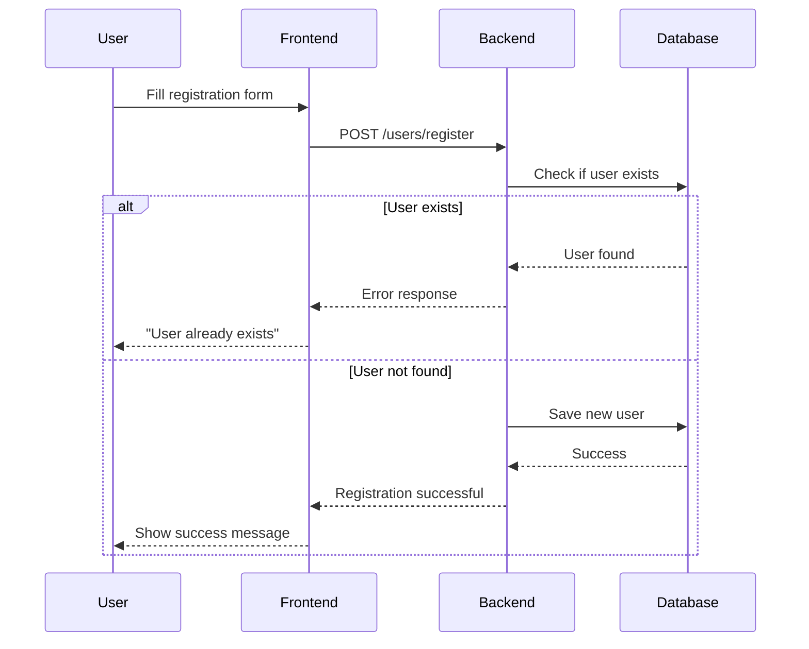

---

## Login Flow

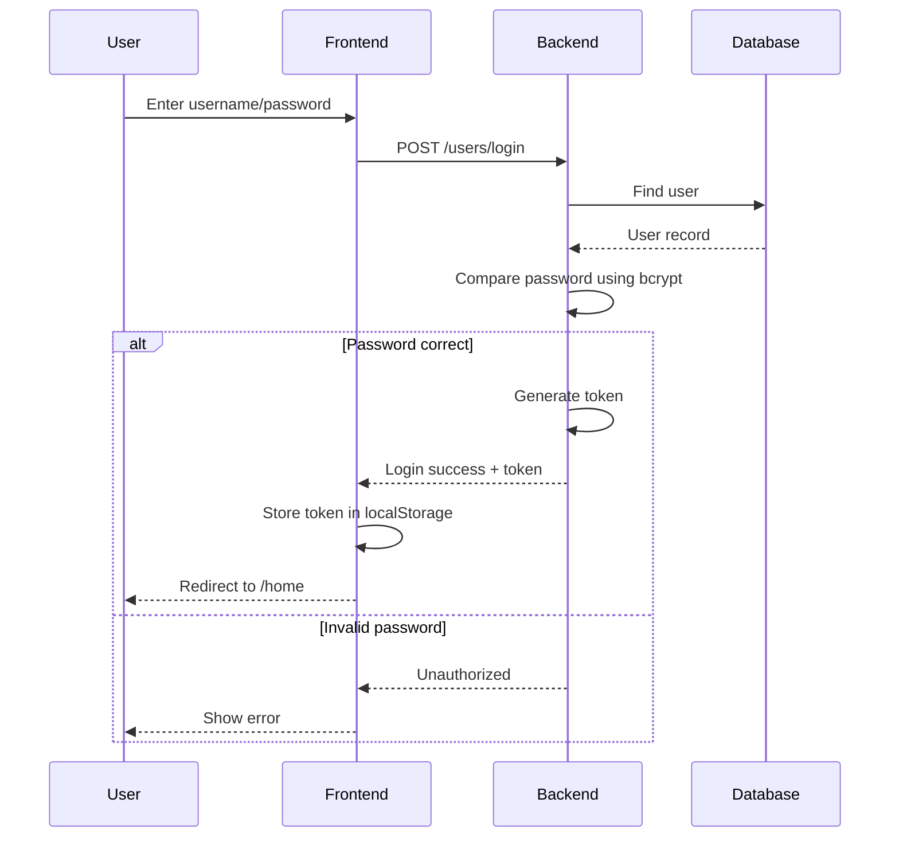

---

# Home Dashboard Workflow

The home dashboard is a **protected route** accessible only after login.

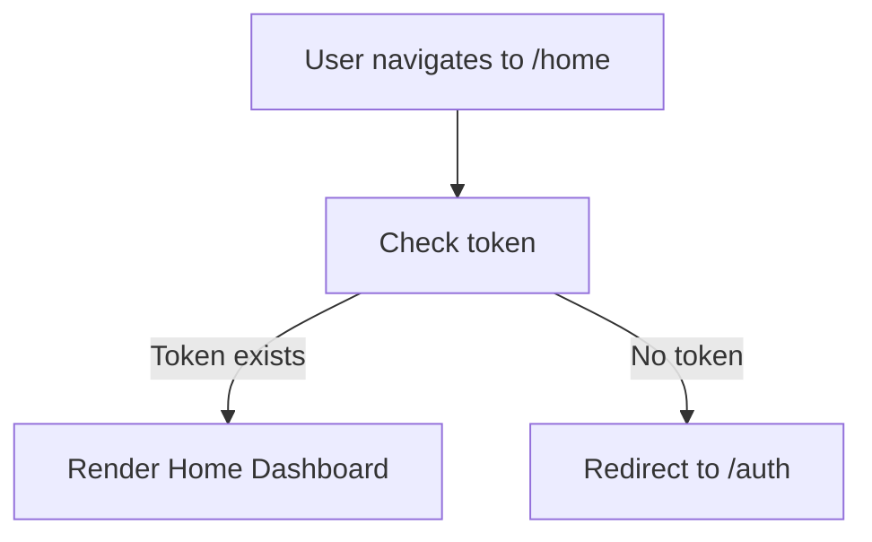

---

# Join Meeting Workflow

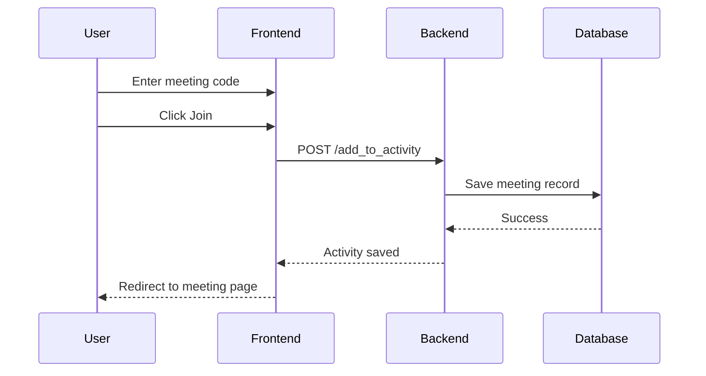

---

# Video Meeting Workflow

The meeting system uses:

- **Socket.io for signaling**
- **WebRTC for peer-to-peer video communication**

```mermaid
sequenceDiagram

participant UserA
participant SignalingServer
participant UserB

UserA->>SignalingServer: join-call(room)

SignalingServer-->>UserB: user-joined

UserA->>UserB: WebRTC Offer

UserB->>UserA: WebRTC Answer

UserA->>UserB: ICE Candidates
UserB->>UserA: ICE Candidates

UserA<->>UserB: Direct Video & Audio Stream
```

---

# Chat Messaging Workflow

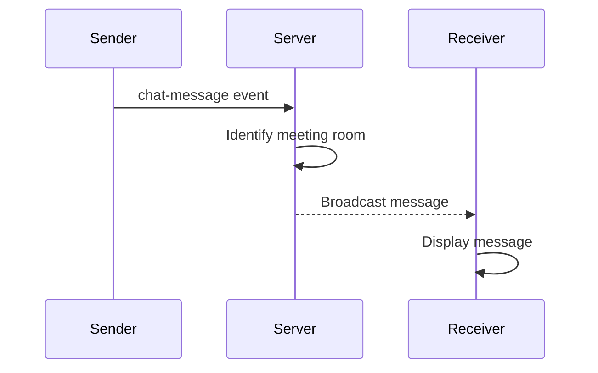

---

# User Disconnect Workflow

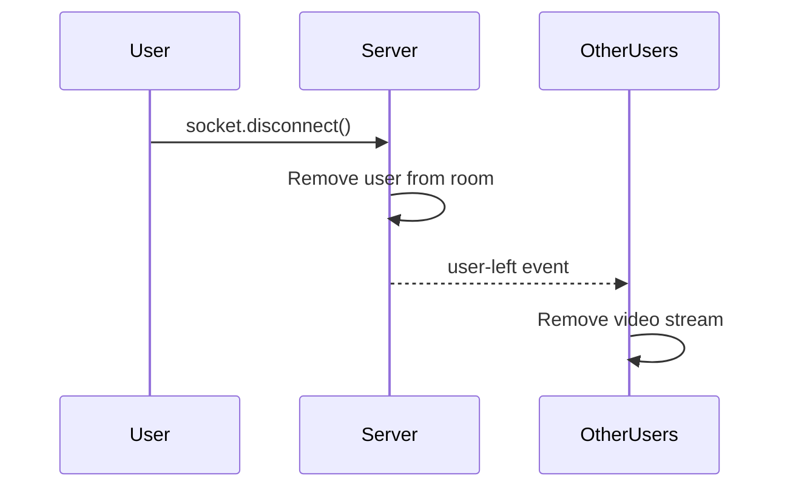

---

# Meeting History Workflow

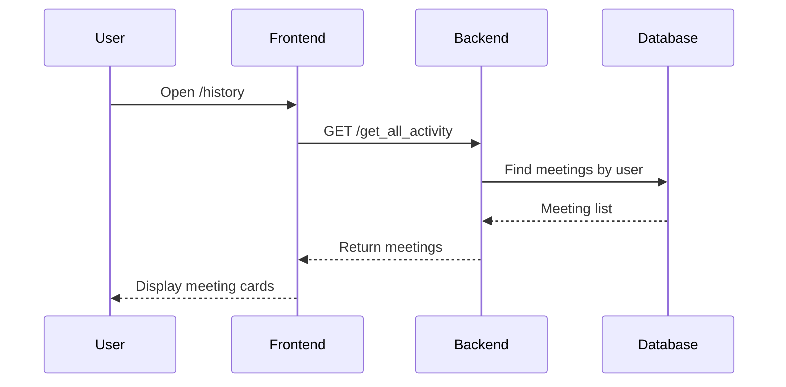

---

# Theme Toggle Workflow

```mermaid
flowchart TD

User[User clicks theme icon] --> Toggle[toggleTheme()]

Toggle --> UpdateState[Update darkMode state]

UpdateState --> Save[Save to localStorage]

Save --> Rerender[Components re-render with new theme]
```

---

# Logout Workflow

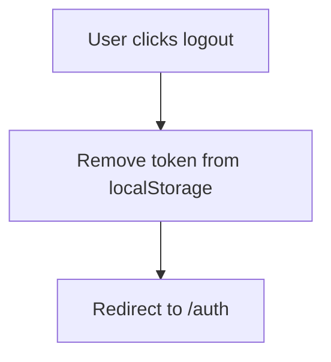

---

# Error Handling

| Error Code | Meaning | UI Action |
|------|------|------|
| 200 | Success | Process response |
| 201 | Created | Show success message |
| 401 | Unauthorized | Show invalid credentials |
| 404 | Not Found | User not found |
| 500 | Server Error | Show generic error |

---

# WebRTC Error Handling

| Error | Handling |
|------|------|
| Permission denied | Disable camera/mic |
| ICE failure | Attempt reconnection |
| SDP negotiation error | Skip peer |
| Media track ended | Replace stream |

---

# Complete Application State Flow

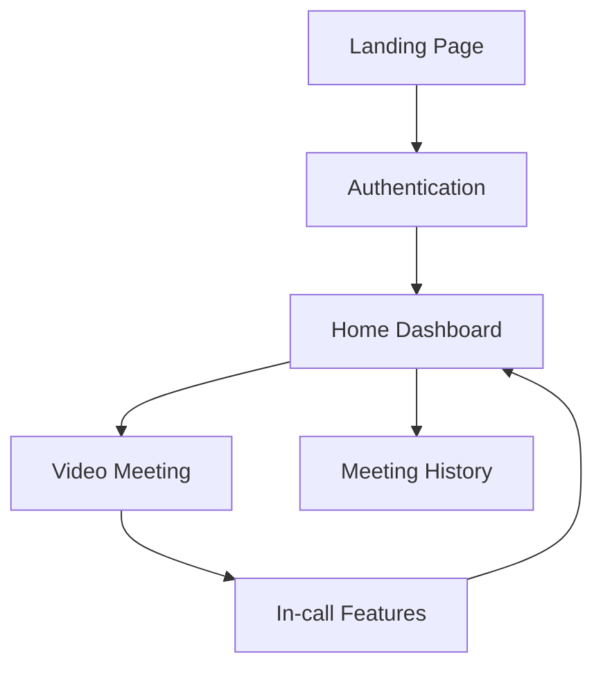

---

# Summary

NeoMeet's workflow architecture includes:

- Secure **token-based authentication**
- Real-time **Socket.io signaling**
- Peer-to-peer **WebRTC video communication**
- Persistent **MongoDB meeting history**
- Customizable **Dark/Light UI themes**

This workflow ensures **low latency communication, scalable architecture, and smooth user experience**.

---

*Workflow Documentation – NeoMeet Video Conferencing Platform*
